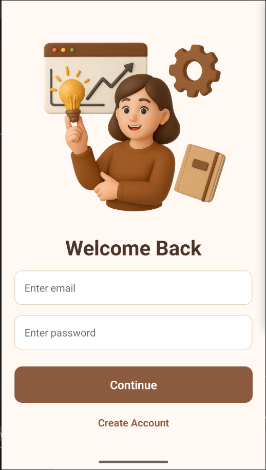
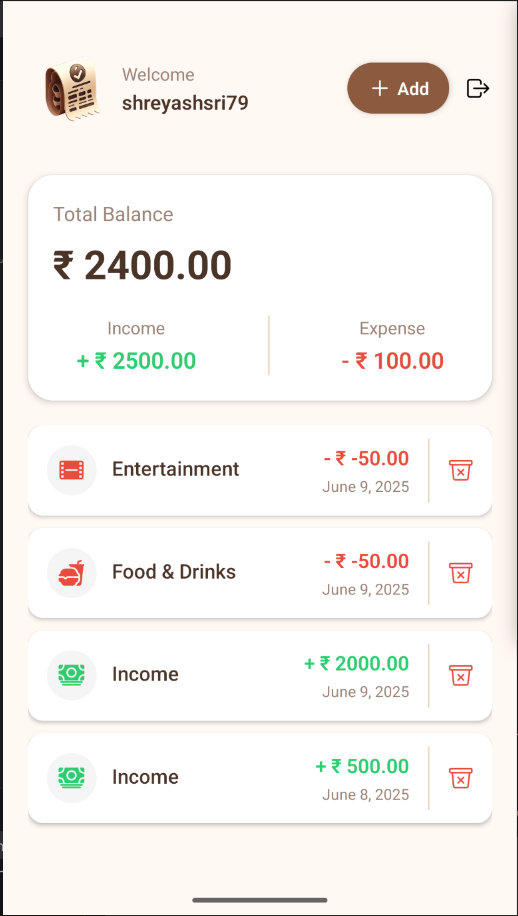

# 💸 Expense Tracker App

A full-stack expense tracker built as a learning project to understand backend best practices, authentication flows, database integration, and scalable mobile development.

## ✨ Features

* 📱 **React Native Frontend**

  * Scalable routing using `(auth)` and `(root)` folder structure
  * Clerk authentication for secure user login/signup
  * Clean and responsive UI optimized for mobile
  * Tracks and displays expenses in real-time

* ⚙️ **Express Backend**

  * Modular structure with controllers, routes, and middlewares
  * Environment variable management with `.env` support
  * Scheduled tasks using cron jobs (e.g., cleanup, reminders)
  * Rate limiting with Redis using Upstash

* 🛢 **PostgreSQL Database**

  * Hosted on [Neon.tech](https://neon.tech/)
  * Secure, fast, and scalable

* ☁️ **Deployment**

  * Backend deployed on [Railway](https://railway.app/)
  * Stateless and serverless architecture friendly

---

## 📚 Tech Stack

### Frontend

* React Native
* Clerk (Authentication)

### Backend

* Node.js
* Express
* Redis (Upstash)
* PostgreSQL (Neon)
* Railway (Deployment)
* Cron Jobs

---

## 📂 Project Structure

### Backend

```
backend/
├── src/
|   ├── controllers/
|   ├── routes/
|   ├── middlewares/
|   ├── config/
|   └── app.js
└── .env

```

### Frontend

```
frontend/
├── .expo/
├── .vscode/
├── app/
│   ├── (auth)/
│   │   ├── _layout.js
│   │   ├── sign-in.js
│   │   └── sign-out.js
│   ├── (root)/
│   │   ├── _layout.js
│   │   ├── create.js
│   │   └── index.js
│   └── _layout.js
├── assets/
├── components/
├── constants/
├── hooks/
├── libs/
└── .env
```

---

## 🖼️ Screenshots






---

## 🛠 Setup Instructions

### Backend

```bash
cd backend
npm install
# Add your environment variables in a .env file
npm run dev
```

### Frontend

```bash
cd mobile
npm install
npx expo
```

---

## 🚀 Future Improvements

* Add budgeting goals
* Visualizations using charts
* Export data as CSV/PDF
* Push notifications

---

## 🙋‍♂️ Author

Built with ❤️ by a first-year student passionate about full-stack development and clean architecture.

Feel free to contribute or fork!
